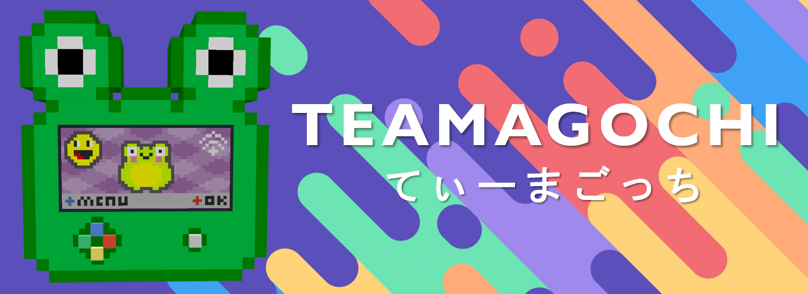

## Description

Teamagochi is a synchronized always-online pet simulator with multiplayer functionality​ by the RIOT Project SoSe24 team. 

It consists of a [physical device (Node)](./node/), [web backend](./web_backend/) and [web/mobile frontend](./web_backend/).

### [Documentation Page](https://smartuni.github.io/teamagochi/docs)

### [Kanban Board](https://github.com/orgs/smartuni/projects/2)

## Contributing

### Cloning

Make sure to clone the repository with the `--recursive` flag to also clone the submodules.

```bash
git clone --recursive git@github.com:smartuni/teamagochi.git
```

or if you have already cloned the repository, you can run:

```bash
git submodule update --init --recursive
```

### Workflow

- Create a new branch for your feature or bugfix (`git checkout -b feature/my-feature`)
- Commit your changes (You can use VSCode or Github Desktop for an easier way to commit)
- Push to the branch (`git push origin feature/my-feature`)
- Create a Pull Request
- Ask somebody (preferably a team member) to review your code
- Wait for the reviewer to approve your PR (or ask for changes)
- Merge your PR

### Avoiding conflicts

- Make sure to keep each branch concise and focused on a single feature or bugfix
- Avoid working on multiple projects at the same time
- Merge changes from the main branch into your feature branch regularly (`git pull origin main`)
- Communicate with your team members about what you are working on
